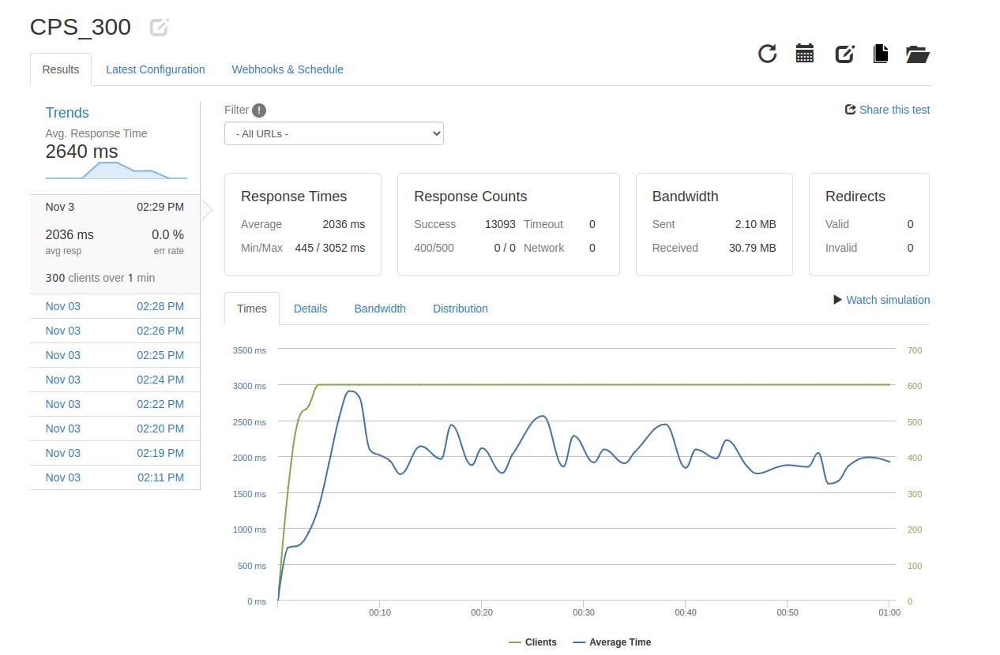
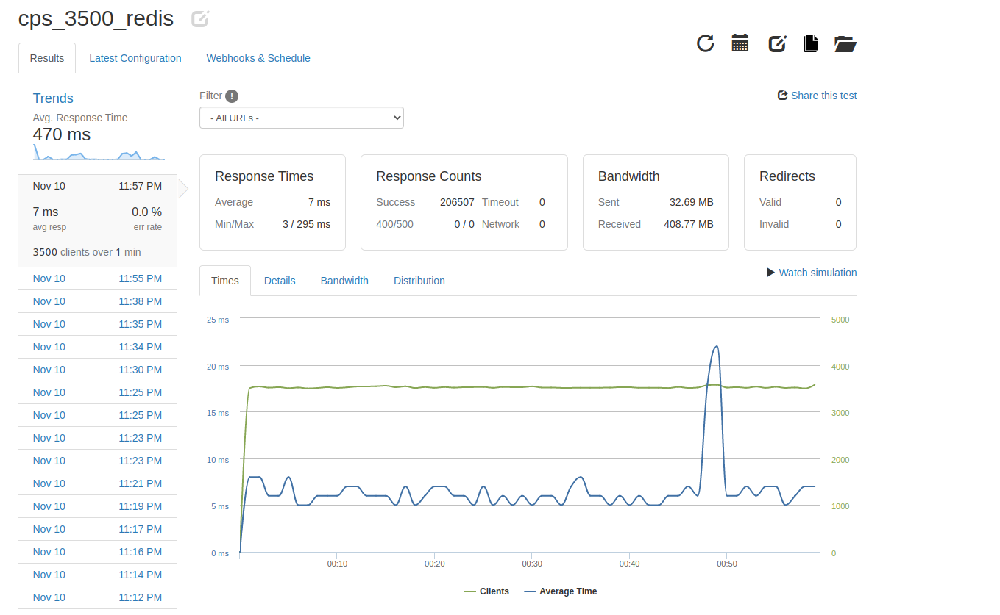

# Questions / Answers Microservice
This project transformed a monolithic backend of the Atelier e-commerce website into a scalable question/answer microservice
 
• Set up ETL pipeline using PostgreSQL for legacy data of 30 million records  
• Implemented RESTful API  
• Horizontally scaled service to 4 Amazon EC2 instances behind NGINX load balancer and implemented Redis caching for quick database retrievals  
• Used New Relic and loader.io to identify bottlenecks  
• Optimized database performance by consolidating three separate SQL queries into a single query using aggregate functions  
• Achieved 3500 RPS at 7ms response time

# Initial Testing metrics for GET /questions
 

 
300 requests / second @ 2036 ms latency
 

# Metrics for GET /questions after NGINX load balancer and Redis cache
 

 
3500 requests / second @ 7 ms latency
